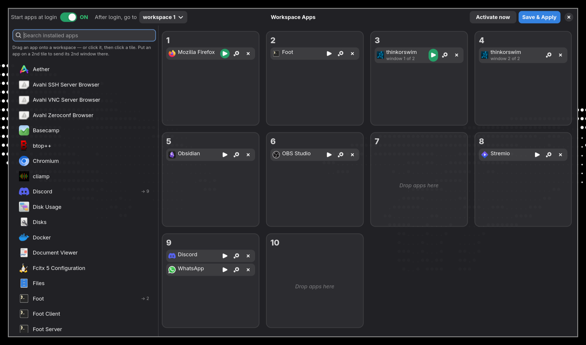

# Workspace Apps: give every app its own Hyprland workspace

**A drag-and-drop GUI to assign apps to Hyprland workspaces.** Pick your
installed apps, drop them on workspace tiles, press **Save**. From then on each
app always opens on its own workspace, and can launch there automatically at
login. You don't have to write window rules by hand, and you don't have to
search for your apps every time.

Works on **[Omarchy](https://omarchy.org)** and any **Hyprland 0.55+** setup with
the Lua config (`~/.config/hypr/hyprland.lua`). Built with Python, GTK4 and
libadwaita.



## What it does

- **Dedicated workspace per app.** Firefox always on 1, the terminal on 2,
  Obsidian on 5, and so on. Super + number takes you straight to the app.
- **Drag and drop, or click.** Drag an app from the list onto a tile, or click
  the app and then click the tile.
- **Launch at login (autostart).** Press ▶ on an app (it turns green) and it
  starts on its workspace every time you log in.
- **One green/red switch for all of it.** *Start apps at login*: green = your ▶
  apps start at login, red = nothing starts (your workspace assignments keep
  working either way).
- **Activate now.** One click starts your ▶ apps right away, each on its own
  workspace, and moves windows that are already open to where they belong. It
  does the same as a fresh login, without logging out.
- **Choose where you land after login.** For example, start all your apps and
  still end up on workspace 1.
- **One app, several workspaces.** Drop an app on a 2nd tile and its **2nd
  window** goes there: the main window on 3 and a second window (like a
  detached chart in thinkorswim) on 4. Handy for trading platforms, IDEs, chat
  apps, or anything that opens more than one window.
- **Handles web apps and terminal apps.** It recognises Chromium `--app` web
  apps (Omarchy's WhatsApp, Discord, YouTube…) and terminal apps started with
  `--app-id`.
- **Plain config, nothing hidden.** It writes ordinary Hyprland rules to
  `~/.config/hypr/workspace-apps.lua`, which you can read at any time.

## Install

Requirements: Hyprland 0.55 or newer (Lua config), Python 3.9+, GTK 4.12+,
libadwaita 1.5+. Omarchy already ships all of these.

```bash
git clone https://github.com/seatrips/hyprland-workspace-apps.git
cd hyprland-workspace-apps
./install.sh
```

On a non-Omarchy Arch system, install the dependencies first if needed:

```bash
sudo pacman -S --needed python-gobject gtk4 libadwaita
```

The installer only copies files into your home directory:

| File | Purpose |
|---|---|
| `~/.local/bin/workspace-apps` | the app |
| `~/.local/share/applications/workspace-apps.desktop` | makes it show up in your app launcher |

## How to use

1. **Open it.** Search for **Workspace Apps** in your launcher (on Omarchy:
   Super + Space), or run `workspace-apps` in a terminal.
2. **Assign apps.** Drag an app from the left list onto a workspace tile.
   Or click the app, then click the tile. Use the search box to find apps
   quickly.
3. **Optional: autostart.** Press **▶** on an app (it turns green) to start
   it at login. Use **After login, go to** (top left) to choose which
   workspace you see once everything has started.
4. **Press Save & Apply.** Hyprland reloads immediately; no logout needed.
   Open an app and it goes to its workspace.
5. **Press Activate now** to start the ▶ apps immediately, each on its own
   workspace, and to move open windows into place.

### Start apps at login: the green/red switch

| Switch | What happens when you log in |
|---|---|
| 🟢 **ON** (green) | Every app with a green ▶ starts on its workspace |
| 🔴 **OFF** (red) | Nothing starts; you open apps yourself, and they still go to their workspaces |

Your ▶ choices are remembered while the switch is off, so turning it back on
restores them. Press **Save & Apply** after flipping it.

### Activate now

**Activate now** saves, then:

- starts every ▶ app that isn't running yet, on its own workspace,
- moves windows that are already open but on the wrong workspace to the
  right one (for apps with two workspaces: window 1 to the first, window 2 to
  the second),
- then takes you to the **After login, go to** workspace.

It works whether the login switch is on or off. You can also run it from a
terminal or a keybinding:

```bash
workspace-apps --activate
```

For example, bind it in `~/.config/hypr/bindings.lua` (Omarchy):

```lua
o.bind("SUPER + SHIFT + W", "Activate workspace apps", os.getenv("HOME") .. "/.local/bin/workspace-apps --activate")
```

### Moving and removing

| To… | Do this |
|---|---|
| Move an app to another workspace | Drag its chip from one tile to another tile |
| Give an app an extra workspace | Drag it from the **left list** onto a second tile |
| Remove an app from a workspace | Press **✕** on its chip |
| Start an app at login / with Activate now | Press **▶** on its chip (green = on) |

### One app on two (or more) workspaces

Drop the same app on two tiles. The chips then read **window 1 of 2** and
**window 2 of 2**:

- the app's **1st window** opens on the first tile,
- its **2nd window** goes to the second tile, and so on.

When an extra window opens you stay where you are, so press Super + number to
see it. Small pop-ups (dialogs, order confirmations) are not counted as windows
and stay where they open. If you close window 2 and open a new one, it goes
back to the second tile.

### An app doesn't land on its workspace?

Hyprland matches windows by their **class**. Workspace Apps guesses it from the
app's desktop file, which works for most apps. If one doesn't move:

1. Open that app.
2. In Workspace Apps, press **⚙** on its chip.
3. Pick the app's window from the **open windows** list. Its class fills in
   automatically. Press **Save & Apply**.

You can also type the class as a regex, e.g. `(?i)firefox`. Run `hyprctl
clients` to see the class of every open window.

## How it works

Saving writes three things:

| File | What's in it |
|---|---|
| `~/.config/hypr/workspace-apps.json` | your layout (what the GUI loads) |
| `~/.config/hypr/workspace-apps.lua` | generated Hyprland config, see below |
| `~/.config/hypr/hyprland.lua` | gets **one line** that loads the file above (a backup is made first) |

The generated config is plain Hyprland Lua:

```lua
hl.window_rule({ match = { class = [===[(?i)firefox]===] }, workspace = "1" })
hl.window_rule({ match = { class = [===[(?i)install4j-com-devexperts-jnlp-Launcher]===] }, workspace = "3" })

hl.on("hyprland.start", function()
  hl.exec_cmd([===[uwsm-app -- firefox.desktop]===])
  hl.exec_cmd([===[uwsm-app -- /home/you/.local/bin/workspace-apps --daemon]===])
end)
```

- **Window rules** send each app to its (first) workspace.
- **Autostart** uses `uwsm-app` when available (Omarchy), otherwise `gtk-launch`.
- **Multiple workspaces per app:** window rules can't tell two windows of the
  same app apart, so a tiny background helper (`workspace-apps --daemon`)
  listens on Hyprland's event socket and moves the 2nd, 3rd… window to the next
  free workspace on the app's list. It only starts when some app has more than
  one workspace. It's a single Python process with no polling, so it uses no
  CPU while idle.

## Uninstall

```bash
./uninstall.sh          # removes the app and the generated rules, keeps your layout
./uninstall.sh --purge  # also deletes your saved layout
```

This also removes the line from `hyprland.lua` (after backing it up) and reloads
Hyprland.

## FAQ

**Does it work with the old `hyprland.conf` (hyprlang) config?**
No. It writes Lua config, which Hyprland uses since 0.55. Omarchy 4 uses Lua.

**Does it work on multiple monitors?**
Yes. It assigns workspaces; Hyprland decides which monitor shows each
workspace (see `workspace` rules in the Hyprland wiki).

**Is it an Omarchy plugin?**
It's a standalone app that fits Omarchy's defaults (it uses `uwsm-app` and
loads next to Omarchy's own `autostart.lua`), but it doesn't depend on Omarchy.

**Can I edit `workspace-apps.lua` by hand?**
It's regenerated on every save, so put your own rules in another file.

## License

[MIT](LICENSE) © seatrips

<!-- Keywords: hyprland workspace manager, assign application to workspace,
hyprland window rules gui, hyprland autostart apps on workspace, omarchy
workspace, open app on specific workspace, dedicated workspace per app,
wayland tiling window manager, arch linux, gtk4 libadwaita -->
